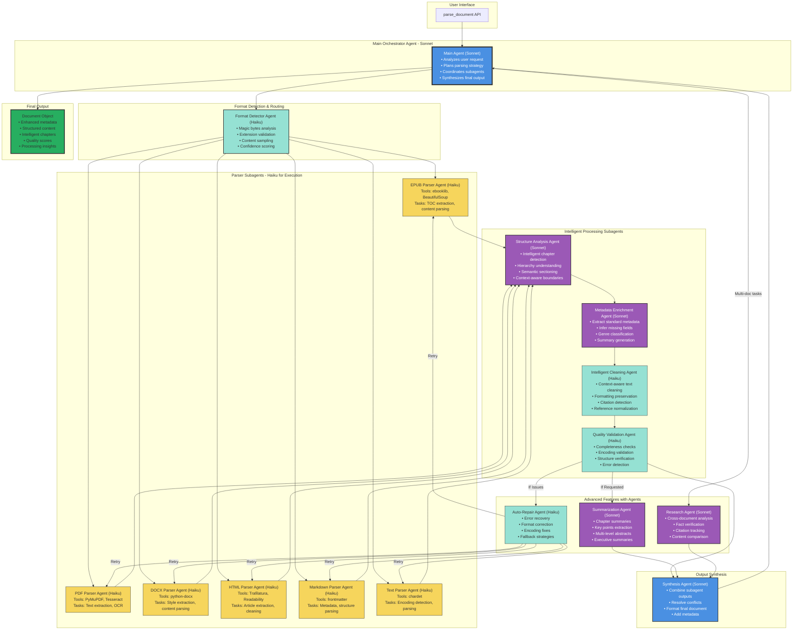

```mermaid
graph TB
    subgraph User Interface
        API[parse_document API]
    end

    subgraph Main Orchestrator Agent - Sonnet
        MainAgent["Main Agent (Sonnet)<br/>• Analyzes user request<br/>• Plans parsing strategy<br/>• Coordinates subagents<br/>• Synthesizes final output"]
    end

    API --> MainAgent

    subgraph Format Detection & Routing
        FormatAgent["Format Detector Agent (Haiku)<br/>• Magic bytes analysis<br/>• Extension validation<br/>• Content sampling<br/>• Confidence scoring"]
    end

    MainAgent --> FormatAgent

    subgraph Parser Subagents - Haiku for Execution
        EPUBAgent["EPUB Parser Agent (Haiku)<br/>Tools: ebooklib, BeautifulSoup<br/>Tasks: TOC extraction, content parsing"]
        PDFAgent["PDF Parser Agent (Haiku)<br/>Tools: PyMuPDF, Tesseract<br/>Tasks: Text extraction, OCR"]
        DOCXAgent["DOCX Parser Agent (Haiku)<br/>Tools: python-docx<br/>Tasks: Style extraction, content parsing"]
        HTMLAgent["HTML Parser Agent (Haiku)<br/>Tools: Trafilatura, Readability<br/>Tasks: Article extraction, cleaning"]
        MDAgent["Markdown Parser Agent (Haiku)<br/>Tools: frontmatter<br/>Tasks: Metadata, structure parsing"]
        TextAgent["Text Parser Agent (Haiku)<br/>Tools: chardet<br/>Tasks: Encoding detection, parsing"]
    end

    FormatAgent --> EPUBAgent & PDFAgent & DOCXAgent & HTMLAgent & MDAgent & TextAgent

    subgraph Intelligent Processing Subagents
        StructureAgent["Structure Analysis Agent (Sonnet)<br/>• Intelligent chapter detection<br/>• Hierarchy understanding<br/>• Semantic sectioning<br/>• Context-aware boundaries"]
        
        MetadataAgent["Metadata Enrichment Agent (Sonnet)<br/>• Extract standard metadata<br/>• Infer missing fields<br/>• Genre classification<br/>• Summary generation"]
        
        QualityAgent["Quality Validation Agent (Haiku)<br/>• Completeness checks<br/>• Encoding validation<br/>• Structure verification<br/>• Error detection"]
        
        CleaningAgent["Intelligent Cleaning Agent (Haiku)<br/>• Context-aware text cleaning<br/>• Formatting preservation<br/>• Citation detection<br/>• Reference normalization"]
    end

    EPUBAgent & PDFAgent & DOCXAgent & HTMLAgent & MDAgent & TextAgent --> StructureAgent
    StructureAgent --> MetadataAgent
    MetadataAgent --> CleaningAgent
    CleaningAgent --> QualityAgent

    subgraph Advanced Features with Agents
        ResearchAgent["Research Agent (Sonnet)<br/>• Cross-document analysis<br/>• Fact verification<br/>• Citation tracking<br/>• Content comparison"]
        
        SummaryAgent["Summarization Agent (Sonnet)<br/>• Chapter summaries<br/>• Key points extraction<br/>• Multi-level abstracts<br/>• Executive summaries"]
        
        RepairAgent["Auto-Repair Agent (Haiku)<br/>• Error recovery<br/>• Format correction<br/>• Encoding fixes<br/>• Fallback strategies"]
    end

    QualityAgent --> |If Issues| RepairAgent
    RepairAgent --> |Retry| EPUBAgent & PDFAgent & DOCXAgent & HTMLAgent & MDAgent & TextAgent
    QualityAgent --> |If Requested| SummaryAgent
    MainAgent --> |Multi-doc tasks| ResearchAgent

    subgraph Output Synthesis
        Synthesizer["Synthesis Agent (Sonnet)<br/>• Combine subagent outputs<br/>• Resolve conflicts<br/>• Format final document<br/>• Add metadata"]
    end

    QualityAgent --> Synthesizer
    SummaryAgent --> Synthesizer
    ResearchAgent --> Synthesizer

    subgraph Final Output
        Output["Document Object<br/>• Enhanced metadata<br/>• Structured content<br/>• Intelligent chapters<br/>• Quality scores<br/>• Processing insights"]
    end

    Synthesizer --> MainAgent
    MainAgent --> Output

    style MainAgent fill:#4A90E2,stroke:#333,stroke-width:4px,color:#fff
    style FormatAgent fill:#95E1D3,stroke:#333,stroke-width:2px
    style EPUBAgent fill:#F6D55C,stroke:#333
    style PDFAgent fill:#F6D55C,stroke:#333
    style DOCXAgent fill:#F6D55C,stroke:#333
    style HTMLAgent fill:#F6D55C,stroke:#333
    style MDAgent fill:#F6D55C,stroke:#333
    style TextAgent fill:#F6D55C,stroke:#333
    style StructureAgent fill:#9B59B6,stroke:#333,stroke-width:2px,color:#fff
    style MetadataAgent fill:#9B59B6,stroke:#333,stroke-width:2px,color:#fff
    style SummaryAgent fill:#9B59B6,stroke:#333,stroke-width:2px,color:#fff
    style ResearchAgent fill:#9B59B6,stroke:#333,stroke-width:2px,color:#fff
    style QualityAgent fill:#95E1D3,stroke:#333
    style CleaningAgent fill:#95E1D3,stroke:#333
    style RepairAgent fill:#95E1D3,stroke:#333
    style Synthesizer fill:#4A90E2,stroke:#333,stroke-width:2px,color:#fff
    style Output fill:#27AE60,stroke:#333,stroke-width:3px
```