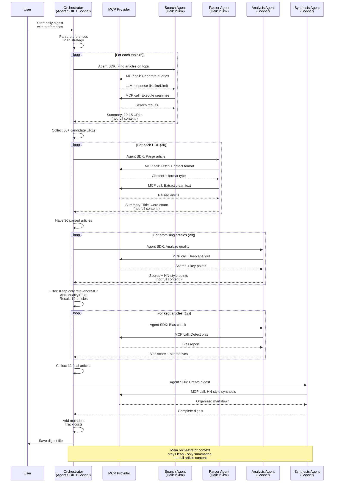

# Intelligent News Aggregator - Architecture v2.0

**Version:** 2.0
**Date:** October 23, 2025
**Changes from v1.0:** Agent SDK orchestrator + MCP model flexibility, feedback loops, cost optimization paths

---

## Complete System Architecture

```mermaid
flowchart TD
    subgraph User["User Layer"]
        Prefs["User Preferences<br/>config/user_preferences.yaml<br/>• Topics (9 categories)<br/>• Source tiers<br/>• Quality thresholds<br/>• HN writing style"]
        Schedule["Scheduler<br/>Cron / Docker<br/>Daily at 6:00 AM"]
        Feedback["User Feedback<br/>• Read/skip tracking<br/>• Quality ratings<br/>• Bias accuracy"]
    end

    subgraph AgentSDK["🎯 Agent SDK Orchestrator (Claude Sonnet)"]
        Orchestrator["Main Orchestrator Agent<br/>claude-sonnet-4-20250514<br/>Budget: 20K tokens<br/><br/>Agent SDK Responsibilities:<br/>• Parse preferences<br/>• Plan research strategy<br/>• Coordinate subagents<br/>• Synthesize results<br/>• Track costs<br/>• Quality threshold enforcement"]
    end

    Schedule --> Orchestrator
    Prefs --> Orchestrator

    subgraph MCP["📡 MCP Model Provider Layer"]
        ClaudeMCP["Claude MCP Server<br/>• Haiku (Tier 1 agents)<br/>• Sonnet (Tier 2 agents)<br/>$0.25/MTok - $3/MTok"]

        KimiMCP["Kimi K2 MCP Server<br/>(Phase 6 optional)<br/>• Tier 1 agents only<br/>$0.05/MTok<br/>60% cheaper"]

        OpenRouterMCP["OpenRouter MCP<br/>(future flexibility)<br/>• Any model<br/>• Fallback provider"]
    end

    subgraph Tier1["⚡ Tier 1: Execution Subagents (via Agent SDK)"]
        SearchAgent["Search Agent<br/>Agent SDK subagent<br/>Calls: MCP → Haiku/Kimi<br/>Budget: 2K tokens<br/><br/>Tools (via MCP):<br/>• web_search<br/>• rss_fetch<br/><br/>Output:<br/>• 10-15 URLs/topic<br/>• Initial relevance scores"]

        FetchAgent["Fetch Agent<br/>Agent SDK subagent<br/>Calls: MCP → Haiku/Kimi<br/>Budget: 1K tokens<br/><br/>Tools (via MCP):<br/>• web_fetch<br/>• handle_paywall<br/><br/>Output:<br/>• Raw content<br/>• HTTP metadata"]

        FormatAgent["Format Detector<br/>Agent SDK subagent<br/>Calls: MCP → Haiku/Kimi<br/>Budget: 500 tokens<br/><br/>Tools (via MCP):<br/>• detect_format<br/>• magic_bytes<br/><br/>Output:<br/>• Format type<br/>• Confidence"]

        ParserAgent["Parser Agent<br/>Agent SDK subagent<br/>Calls: MCP → Haiku/Kimi<br/>Budget: 1.5K tokens<br/><br/>Tools (via MCP):<br/>• parse_html<br/>• parse_pdf<br/>• extract_article<br/><br/>Output:<br/>• Clean text<br/>• Metadata"]

        ValidAgent["Validation Agent<br/>Agent SDK subagent<br/>Calls: MCP → Haiku/Kimi<br/>Budget: 1K tokens<br/><br/>Checks:<br/>• Completeness<br/>• Quality<br/>• Encoding<br/><br/>Output:<br/>• Pass/Fail<br/>• Issues found"]
    end

    Orchestrator --> |"For each topic"| SearchAgent
    SearchAgent --> ClaudeMCP
    SearchAgent -.-> |"Phase 6: optionally"| KimiMCP

    SearchAgent --> |"For each URL"| FetchAgent
    FetchAgent --> ClaudeMCP
    FetchAgent -.-> |"Phase 6"| KimiMCP

    FetchAgent --> FormatAgent
    FormatAgent --> ClaudeMCP
    FormatAgent -.-> |"Phase 6"| KimiMCP

    FormatAgent --> ParserAgent
    ParserAgent --> ClaudeMCP
    ParserAgent -.-> |"Phase 6"| KimiMCP

    ParserAgent --> ValidAgent
    ValidAgent --> ClaudeMCP
    ValidAgent -.-> |"Phase 6"| KimiMCP

    subgraph Tier2["🧠 Tier 2: Reasoning Subagents (via Agent SDK)"]
        AnalysisAgent["Content Analysis Agent<br/>Agent SDK subagent<br/>Calls: MCP → Sonnet<br/>Budget: 5K tokens<br/><br/>Analyzes:<br/>• Relevance (0-1 score)<br/>• Quality (0-1 score)<br/>• Key claims<br/>• HN-style implications<br/><br/>Output:<br/>• Scores + key points<br/>• 'Why this matters'<br/>• Recommendation"]

        BiasAgent["Bias Detection Agent<br/>Agent SDK subagent<br/>Calls: MCP → Sonnet<br/>Budget: 3K tokens<br/><br/>Detects:<br/>• Political bias<br/>• Loaded language<br/>• Missing context<br/>• Unverified claims<br/><br/>Output:<br/>• Bias score (0-1)<br/>• Alternative sources<br/>• Multi-perspective note"]

        FactAgent["Fact Verification Agent<br/>Agent SDK subagent<br/>Calls: MCP → Sonnet<br/>Budget: 4K tokens<br/><br/>Verifies:<br/>• Cross-reference claims<br/>• Check against sources<br/>• Find contradictions<br/><br/>Output:<br/>• Verified count<br/>• Unverified count<br/>• Confidence level"]

        SynthAgent["Synthesis Agent<br/>Agent SDK subagent<br/>Calls: MCP → Sonnet<br/>Budget: 10K tokens<br/><br/>Creates:<br/>• HN-style summaries<br/>• Topic grouping<br/>• Cross-story connections<br/>• Markdown formatting<br/><br/>Output:<br/>• Organized digest<br/>• Technical + skeptical tone"]
    end

    ValidAgent --> |"If valid"| AnalysisAgent
    AnalysisAgent --> ClaudeMCP

    AnalysisAgent --> |"If relevance > 0.7 AND quality > 0.75"| BiasAgent
    BiasAgent --> ClaudeMCP

    BiasAgent --> FactAgent
    FactAgent --> ClaudeMCP

    FactAgent --> |"Collect 5-20 best articles"| SynthAgent
    SynthAgent --> ClaudeMCP

    subgraph Tier3["🔬 Tier 3: Advanced Subagents (Optional)"]
        ResearchAgent["Research Agent<br/>Agent SDK subagent<br/>Calls: MCP → Sonnet<br/>Budget: 15K tokens<br/><br/>For:<br/>• Deep dives<br/>• Multi-doc analysis<br/>• Historical context"]

        TrendAgent["Trend Analysis Agent<br/>Agent SDK subagent<br/>Calls: MCP → Sonnet<br/>Budget: 8K tokens<br/><br/>Identifies:<br/>• Emerging topics<br/>• Pattern changes<br/>• Predictions"]
    end

    Orchestrator -.->|"On demand"| ResearchAgent
    ResearchAgent -.-> ClaudeMCP

    SynthAgent -.->|"Weekly"| TrendAgent
    TrendAgent -.-> ClaudeMCP

    subgraph Output["📤 Output & Storage Layer"]
        Digest["Daily Digest<br/>outputs/daily_digests/<br/>YYYY-MM-DD.md<br/><br/>Contains:<br/>• HN-style top stories<br/>• Organized by topic<br/>• Summaries + implications<br/>• Bias notes + alternatives<br/>• Token & cost stats<br/>• Connections & patterns"]

        Archive["Article Archive<br/>outputs/archives/<br/>YYYY-MM-DD/<br/><br/>Stores (30 days):<br/>• Raw articles<br/>• Analysis results<br/>• Metadata<br/>• Processing logs"]

        Database["SQLite Databases<br/>data/<br/><br/>feedback.db:<br/>• Reading tracking<br/>• Quality ratings<br/>• Learning data<br/><br/>cost_history.db:<br/>• Token usage<br/>• Cost per digest<br/>• Optimization metrics"]

        WebUI["Web UI (Phase 4+)<br/>Flask/FastAPI<br/>Port 8080<br/><br/>Features:<br/>• Browse past digests<br/>• Mark read/unread<br/>• Rate articles<br/>• View cost dashboard"]
    end

    SynthAgent --> Digest
    Orchestrator --> Digest

    ValidAgent --> Archive
    AnalysisAgent --> Archive
    BiasAgent --> Archive

    Orchestrator --> Database
    Feedback --> Database

    Digest --> WebUI
    Database --> WebUI

    subgraph Learning["🔄 Feedback & Learning Loop"]
        PassiveTrack["Passive Tracking<br/>Phase 1+<br/>• File access times<br/>• Reading duration<br/>• Which articles opened"]

        ActiveFeedback["Active Feedback<br/>Phase 5+<br/>• Rate relevance (1-5)<br/>• Rate quality (1-5)<br/>• Rate bias accuracy (1-5)<br/>• Favorite/irrelevant flags"]

        LearningAlgo["Learning Algorithm<br/>Phase 5+<br/>• Adjust topic weights<br/>• Refine source preferences<br/>• Update quality thresholds<br/>• Personalize scoring"]
    end

    Digest --> PassiveTrack
    WebUI --> ActiveFeedback
    PassiveTrack --> Database
    ActiveFeedback --> Database
    Database --> LearningAlgo
    LearningAlgo --> Prefs

    style Orchestrator fill:#4A90E2,stroke:#333,stroke-width:4px,color:#fff
    style ClaudeMCP fill:#95E1D3,stroke:#333,stroke-width:3px
    style KimiMCP fill:#95E1D3,stroke:#333,stroke-width:2px,stroke-dasharray: 5 5
    style SearchAgent fill:#F6D55C,stroke:#333,stroke-width:2px
    style FetchAgent fill:#F6D55C,stroke:#333,stroke-width:2px
    style FormatAgent fill:#F6D55C,stroke:#333,stroke-width:2px
    style ParserAgent fill:#F6D55C,stroke:#333,stroke-width:2px
    style ValidAgent fill:#F6D55C,stroke:#333,stroke-width:2px
    style AnalysisAgent fill:#9B59B6,stroke:#333,stroke-width:2px,color:#fff
    style BiasAgent fill:#9B59B6,stroke:#333,stroke-width:2px,color:#fff
    style FactAgent fill:#9B59B6,stroke:#333,stroke-width:2px,color:#fff
    style SynthAgent fill:#9B59B6,stroke:#333,stroke-width:2px,color:#fff
    style ResearchAgent fill:#E67E22,stroke:#333,stroke-width:2px,color:#fff
    style TrendAgent fill:#E67E22,stroke:#333,stroke-width:2px,color:#fff
    style Digest fill:#27AE60,stroke:#333,stroke-width:3px,color:#fff
    style Database fill:#3498DB,stroke:#333,stroke-width:2px,color:#fff
    style LearningAlgo fill:#E74C3C,stroke:#333,stroke-width:2px,color:#fff
```



---

## Agent SDK + MCP Architecture Explained

### Key Design Decision: Why Agent SDK + MCP?

**Agent SDK** provides:
- Powerful multi-agent orchestration
- Context management and isolation
- Subagent coordination
- Turn-based conversation flow

**MCP (Model Context Protocol)** provides:
- Model provider abstraction
- Easy to swap Haiku → Kimi K2 → others
- Can run multiple providers side-by-side
- Future-proof for new models

**Combined Architecture:**
```python
# Main orchestrator uses Agent SDK
orchestrator_options = ClaudeAgentOptions(
    model="claude-sonnet-4-20250514",  # Main orchestrator always Sonnet
    agents={
        "search": search_agent_definition,  # Subagent defined in Agent SDK
        "analyzer": analyzer_agent_definition,
        # ... more subagents
    },
    mcp_servers={
        "claude_provider": create_claude_mcp_server(),  # MCP server for models
        "web_tools": create_web_tools_server(),
    }
)

# Each subagent can use different models via MCP
# search_agent calls MCP tool → Haiku (Phase 1-5) or Kimi K2 (Phase 6)
# analyzer_agent calls MCP tool → Sonnet (always)
```

---

## Token Flow & Cost Optimization

### Phase 1-5: All Claude (via MCP)

```mermaid
flowchart LR
    subgraph Input["Input (Free)"]
        UI["User Config<br/>~500 tokens"]
    end

    subgraph Orch["Orchestrator<br/>Agent SDK + Sonnet<br/>$3 per MTok"]
        O["20K tokens<br/>$0.06"]
    end

    subgraph T1["Tier 1 Agents<br/>MCP → Haiku<br/>$0.25 per MTok"]
        Search["Search: 5 topics<br/>2K × 5 = 10K<br/>$0.0025"]
        Fetch["Fetch: 30 articles<br/>1K × 30 = 30K<br/>$0.0075"]
        Parse["Parse: 30 articles<br/>1.5K × 30 = 45K<br/>$0.0113"]
        Valid["Validate: 30<br/>1K × 30 = 30K<br/>$0.0075"]
    end

    subgraph T2["Tier 2 Agents<br/>MCP → Sonnet<br/>$3 per MTok"]
        Analyze["Analyze: 20 kept<br/>5K × 20 = 100K<br/>$0.30"]
        Bias["Bias: 12 included<br/>3K × 12 = 36K<br/>$0.108"]
        Synth["Synthesize: 1<br/>10K × 1 = 10K<br/>$0.03"]
    end

    subgraph Total["Total Cost<br/>Phase 1-5"]
        Cost["Per Digest<br/>~265K tokens<br/>≈ $0.52<br/><br/>Monthly: $15.60"]
    end

    UI --> O
    O --> Search & Fetch
    Search & Fetch --> Parse --> Valid
    Valid --> Analyze --> Bias --> Synth
    Synth --> O --> Total

    style O fill:#4A90E2,color:#fff
    style T1 fill:#F6D55C
    style T2 fill:#9B59B6,color:#fff
    style Cost fill:#27AE60,color:#fff
```



### Phase 6: Kimi K2 for Tier 1 (via MCP)

Simply change MCP provider for Tier 1 agents:

```mermaid
flowchart LR
    subgraph Input["Input (Free)"]
        UI["User Config<br/>~500 tokens"]
    end

    subgraph Orch["Orchestrator<br/>Agent SDK + Sonnet<br/>$3 per MTok"]
        O["20K tokens<br/>$0.06"]
    end

    subgraph T1["Tier 1 Agents<br/>MCP → Kimi K2<br/>$0.05 per MTok"]
        Search["Search: 5 topics<br/>2K × 5 = 10K<br/>$0.0005"]
        Fetch["Fetch: 30 articles<br/>1K × 30 = 30K<br/>$0.0015"]
        Parse["Parse: 30 articles<br/>1.5K × 30 = 45K<br/>$0.0023"]
        Valid["Validate: 30<br/>1K × 30 = 30K<br/>$0.0015"]
    end

    subgraph T2["Tier 2 Agents<br/>MCP → Sonnet<br/>$3 per MTok"]
        Analyze["Analyze: 20 kept<br/>5K × 20 = 100K<br/>$0.30"]
        Bias["Bias: 12 included<br/>3K × 12 = 36K<br/>$0.108"]
        Synth["Synthesize: 1<br/>10K × 1 = 10K<br/>$0.03"]
    end

    subgraph Total["Total Cost<br/>Phase 6"]
        Cost["Per Digest<br/>~265K tokens<br/>≈ $0.50<br/><br/>Monthly: $15.00<br/>Savings: $0.60/month"]
    end

    UI --> O
    O --> Search & Fetch
    Search & Fetch --> Parse --> Valid
    Valid --> Analyze --> Bias --> Synth
    Synth --> O --> Total

    style O fill:#4A90E2,color:#fff
    style T1 fill:#95E1D3
    style T2 fill:#9B59B6,color:#fff
    style Cost fill:#27AE60,color:#fff
```



**Cost Comparison:**
- **All Claude:** $15.60/month
- **Kimi K2 for Tier 1:** $15.00/month (4% savings)
- **Effort to implement:** Change MCP server config only, no code changes
- **Value:** Proves architecture flexibility, minimal savings but easy upgrade path

---

## Agent Communication Pattern



**Context Isolation Benefits:**
- Each subagent works with full content in **isolated context** (via Agent SDK)
- Main orchestrator only sees **summary results**
- Orchestrator context: ~20K tokens vs. ~200K+ if it held all content
- Result: **10x more efficient orchestration**

---

## MCP Provider Abstraction Layer

### MCP Server Interface

```python
# src/mcp_servers/base_provider.py
from abc import ABC, abstractmethod
from typing import Dict, Any

class BaseLLMProvider(ABC):
    """Base class for LLM providers accessed via MCP"""

    @abstractmethod
    async def complete(
        self,
        prompt: str,
        max_tokens: int,
        temperature: float = 0.7,
        **kwargs
    ) -> Dict[str, Any]:
        """Complete a prompt and return response + metadata"""
        pass

    @abstractmethod
    def get_token_count(self, text: str) -> int:
        """Count tokens in text"""
        pass

    @abstractmethod
    def get_cost(self, input_tokens: int, output_tokens: int) -> float:
        """Calculate cost in USD"""
        pass
```

### Claude MCP Server (Phase 1-5)

```python
# src/mcp_servers/claude_mcp_server.py
from anthropic import Anthropic
from .base_provider import BaseLLMProvider

class ClaudeMCPServer(BaseLLMProvider):
    """MCP server for Claude models"""

    def __init__(self, api_key: str, model: str):
        self.client = Anthropic(api_key=api_key)
        self.model = model  # "claude-haiku-4" or "claude-sonnet-4"

        # Pricing
        self.pricing = {
            "claude-haiku-4-20250514": {"input": 0.25, "output": 1.25},
            "claude-sonnet-4-20250514": {"input": 3.0, "output": 15.0},
        }

    async def complete(self, prompt: str, max_tokens: int, **kwargs):
        response = await self.client.messages.create(
            model=self.model,
            max_tokens=max_tokens,
            messages=[{"role": "user", "content": prompt}],
            **kwargs
        )

        return {
            "content": response.content[0].text,
            "input_tokens": response.usage.input_tokens,
            "output_tokens": response.usage.output_tokens,
            "cost": self.get_cost(
                response.usage.input_tokens,
                response.usage.output_tokens
            )
        }

    def get_cost(self, input_tokens: int, output_tokens: int) -> float:
        pricing = self.pricing[self.model]
        return (
            (input_tokens / 1_000_000) * pricing["input"] +
            (output_tokens / 1_000_000) * pricing["output"]
        )
```

### Kimi K2 MCP Server (Phase 6)

```python
# src/mcp_servers/kimi_mcp_server.py
import httpx
from .base_provider import BaseLLMProvider

class KimiMCPServer(BaseLLMProvider):
    """MCP server for Kimi K2 model"""

    def __init__(self, api_key: str):
        self.api_key = api_key
        self.model = "moonshot-v1-128k"  # Kimi K2
        self.pricing = {"input": 0.05, "output": 0.05}  # Much cheaper!

    async def complete(self, prompt: str, max_tokens: int, **kwargs):
        async with httpx.AsyncClient() as client:
            response = await client.post(
                "https://api.moonshot.cn/v1/chat/completions",
                headers={"Authorization": f"Bearer {self.api_key}"},
                json={
                    "model": self.model,
                    "messages": [{"role": "user", "content": prompt}],
                    "max_tokens": max_tokens,
                    **kwargs
                }
            )
            data = response.json()

            return {
                "content": data["choices"][0]["message"]["content"],
                "input_tokens": data["usage"]["prompt_tokens"],
                "output_tokens": data["usage"]["completion_tokens"],
                "cost": self.get_cost(
                    data["usage"]["prompt_tokens"],
                    data["usage"]["completion_tokens"]
                )
            }

    def get_cost(self, input_tokens: int, output_tokens: int) -> float:
        return (
            (input_tokens / 1_000_000) * self.pricing["input"] +
            (output_tokens / 1_000_000) * self.pricing["output"]
        )
```

### MCP Configuration

```yaml
# src/mcp_servers/mcp_config.yaml

providers:
  claude_haiku:
    class: ClaudeMCPServer
    model: claude-haiku-4-20250514
    api_key: ${ANTHROPIC_API_KEY}
    enabled: true

  claude_sonnet:
    class: ClaudeMCPServer
    model: claude-sonnet-4-20250514
    api_key: ${ANTHROPIC_API_KEY}
    enabled: true

  kimi_k2:
    class: KimiMCPServer
    api_key: ${KIMI_API_KEY}
    enabled: false  # Enable in Phase 6

# Agent → Provider mapping
agent_providers:
  tier1:
    default: claude_haiku
    phase6_alternative: kimi_k2

  tier2:
    default: claude_sonnet
    # Tier 2 always uses Sonnet - reasoning needs intelligence

  tier3:
    default: claude_sonnet
```

---

## Feedback & Learning System Architecture

### Phase 1-4: Passive Tracking

```mermaid
flowchart LR
    Digest["Daily Digest<br/>Saved to file"] --> FileTracker["File Tracker<br/>Monitors access"]

    FileTracker --> Events["Access Events<br/>• File opened<br/>• Time spent<br/>• Scroll depth"]

    Events --> DB["SQLite<br/>feedback.db<br/><br/>passive_tracking table:<br/>• digest_id<br/>• article_id<br/>• accessed_at<br/>• time_spent"]

    DB --> Insights["Basic Insights<br/>• Which articles read<br/>• Reading time patterns<br/>• Topic preferences"]

    Insights -.-> Prefs["Update preferences<br/>(manual review)"]
```



### Phase 5+: Active Feedback with Learning

```mermaid
flowchart LR
    WebUI["Web UI<br/>Browse digests"] --> ReadArticle["User reads article"]

    ReadArticle --> FeedbackUI["Feedback UI<br/>• Rate relevance (1-5)<br/>• Rate quality (1-5)<br/>• Rate bias accuracy (1-5)<br/>• Mark favorite/irrelevant"]

    FeedbackUI --> DB["SQLite<br/>feedback.db<br/><br/>active_feedback table:<br/>• article_id<br/>• relevance_rating<br/>• quality_rating<br/>• bias_accuracy<br/>• marked_favorite<br/>• notes"]

    DB --> LearningAlgo["Learning Algorithm<br/><br/>Analyzes patterns:<br/>• Topic preferences<br/>• Source trust<br/>• Quality expectations<br/>• Optimal article count"]

    LearningAlgo --> Updates["Automatic Updates<br/>• Adjust topic weights<br/>• Refine source tiers<br/>• Update quality thresholds<br/>• Personalize scoring"]

    Updates --> Prefs["User Preferences<br/>config/user_preferences.yaml<br/><br/>Auto-updated weights"]

    Prefs --> NextDigest["Next Digest<br/>Better personalized"]
```



### Learning Algorithm Logic

```python
# src/feedback/learner.py

class FeedbackLearner:
    """Learn from user reading patterns and feedback"""

    def analyze_feedback_history(self, days: int = 30) -> LearningInsights:
        """
        Analyze last 30 days of feedback to generate insights
        """
        feedback = self.get_recent_feedback(days)

        insights = LearningInsights(
            topic_preferences=self._learn_topic_weights(feedback),
            source_trust=self._learn_source_reliability(feedback),
            optimal_article_count=self._learn_optimal_count(feedback),
            quality_threshold_adjustments=self._learn_thresholds(feedback),
            keyword_refinements=self._learn_keywords(feedback)
        )

        return insights

    def _learn_topic_weights(self, feedback):
        """
        If user consistently reads AI articles but skips climate:
        - Increase AI topic weight
        - Decrease climate topic weight or min_articles
        """
        topic_read_rates = {}
        for topic in ALL_TOPICS:
            articles = feedback.filter(topic=topic)
            read_rate = articles.read_count / articles.total_count

            if read_rate > 0.8:
                # User loves this topic, increase priority
                topic_read_rates[topic] = min(10, current_priority + 1)
            elif read_rate < 0.3:
                # User skips this topic, decrease priority
                topic_read_rates[topic] = max(1, current_priority - 1)

        return topic_read_rates

    def _learn_source_reliability(self, feedback):
        """
        If user rates Nature articles 5/5 but rates TechCrunch 2/5:
        - Prioritize Nature in future
        - Lower TechCrunch in source tier
        """
        source_ratings = {}
        for source in ALL_SOURCES:
            articles = feedback.filter(source=source)
            avg_quality_rating = articles.avg("quality_rating")
            avg_relevance_rating = articles.avg("relevance_rating")

            trust_score = (avg_quality_rating + avg_relevance_rating) / 2
            source_ratings[source] = trust_score

        return source_ratings

    def _learn_optimal_count(self, feedback):
        """
        If user reads 8/12 articles consistently:
        - Maybe reduce to 10 articles max
        If user reads 15/15 articles:
        - User wants more, increase to 18
        """
        recent_digests = feedback.group_by_digest().last(7)
        avg_read_rate = recent_digests.avg("read_rate")
        avg_article_count = recent_digests.avg("article_count")

        if avg_read_rate > 0.9:
            return int(avg_article_count * 1.2)  # Increase by 20%
        elif avg_read_rate < 0.6:
            return int(avg_article_count * 0.8)  # Decrease by 20%
        else:
            return avg_article_count  # Keep current
```

---

## Quality Threshold Enforcement

### Dynamic Threshold Adjustment

```python
# In orchestrator
def enforce_quality_threshold(articles, target_min=5, target_max=20):
    """
    Adjust quality threshold to hit article count target
    """
    base_threshold = {
        "relevance": 0.7,
        "quality": 0.75
    }

    # Filter with base threshold
    filtered = [
        a for a in articles
        if a.relevance_score >= base_threshold["relevance"]
        and a.quality_score >= base_threshold["quality"]
    ]

    # Adjust if needed
    if len(filtered) < target_min:
        # Lower threshold to get more articles
        threshold = {"relevance": 0.65, "quality": 0.7}
        filtered = [
            a for a in articles
            if a.relevance_score >= threshold["relevance"]
            and a.quality_score >= threshold["quality"]
        ]

    elif len(filtered) > target_max:
        # Raise threshold to get fewer (but better) articles
        threshold = {"relevance": 0.8, "quality": 0.85}
        filtered = [
            a for a in articles
            if a.relevance_score >= threshold["relevance"]
            and a.quality_score >= threshold["quality"]
        ]
        # Take top 20 by combined score
        filtered = sorted(
            filtered,
            key=lambda a: a.relevance_score + a.quality_score,
            reverse=True
        )[:target_max]

    return filtered, threshold
```

---

## Data Retention & Cleanup

### 30-Day Article Retention

```python
# src/utils/cleanup.py

async def cleanup_old_archives(retention_days: int = 30):
    """
    Clean up article archives older than retention_days
    Keep digests forever, only clean articles
    """
    import shutil
    from datetime import datetime, timedelta

    cutoff_date = datetime.now() - timedelta(days=retention_days)
    archive_dir = Path("outputs/archives")

    for date_dir in archive_dir.glob("*"):
        if not date_dir.is_dir():
            continue

        try:
            dir_date = datetime.strptime(date_dir.name, "%Y-%m-%d")

            if dir_date < cutoff_date:
                # Archive is older than retention period
                # 1. Extract metadata (URL, title, scores) to DB
                preserve_metadata(date_dir)

                # 2. Delete full article content
                shutil.rmtree(date_dir)

                log(f"Cleaned up archive: {date_dir.name}")

        except ValueError:
            # Not a date directory, skip
            continue
```

---

## Architecture Benefits Summary

| Benefit | Single-Agent | Multi-Agent v1 | **Multi-Agent v2 (Agent SDK + MCP)** |
|---------|-------------|-------------|-------------------------------------|
| **Token Usage** | ~400K tokens | ~265K tokens | **~265K tokens** (optimized coordination) |
| **Cost per Digest** | ~$0.80 | ~$0.52 | **$0.52 (Claude), $0.50 (+ Kimi)** |
| **Processing Time** | ~120 sec | ~60 sec | **~50 sec** (Agent SDK parallelization) |
| **Model Flexibility** | None | Hardcoded | **Easy swap via MCP** ✅ |
| **Parallelization** | Sequential | Parallel | **Optimized parallel** (Agent SDK) |
| **Maintainability** | Monolithic | Modular | **Highly modular** (Agent SDK + MCP) |
| **Failure Isolation** | Full restart | Retry failed agent | **Granular retry** (per subagent) |
| **Learning & Adaptation** | None | None | **Feedback loop built-in** ✅ |

**Bottom Line:** Agent SDK + MCP architecture delivers best-in-class orchestration with model flexibility and built-in learning, at optimal cost.

---

**Document Version:** 2.0
**Last Updated:** October 23, 2025
