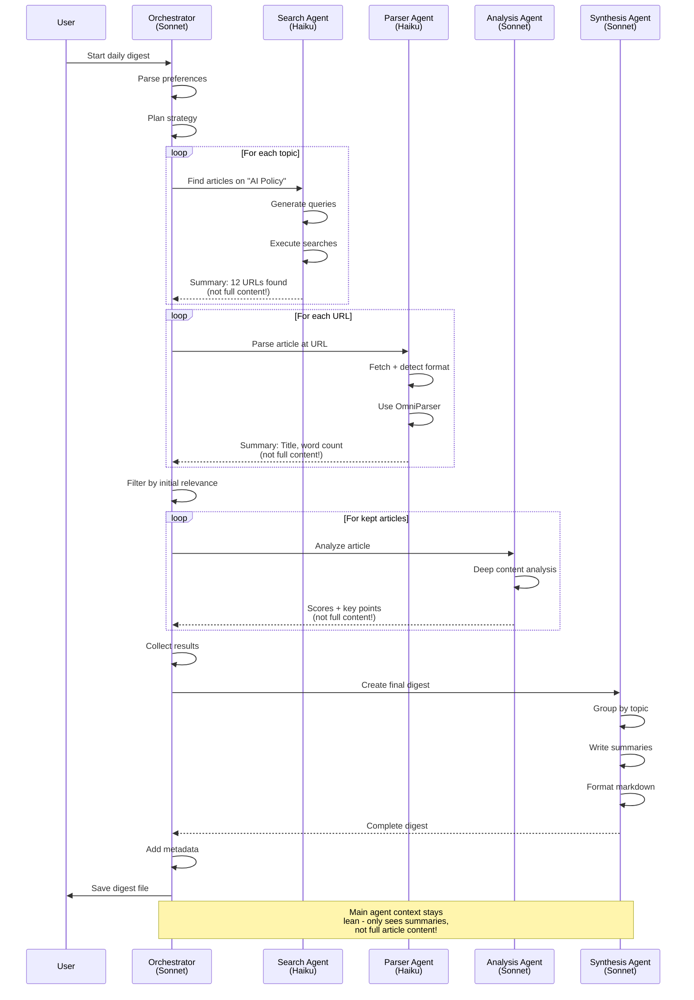

# Intelligent News Aggregator - Agent Architecture Diagram

## Complete System Architecture

```mermaid
flowchart TD
    subgraph User["User Layer"]
        Prefs["User Preferences<br/>config/user_preferences.yaml<br/>• Topics of interest<br/>• Source filters<br/>• Update frequency"]
        Schedule["Scheduler<br/>Cron / Systemd<br/>Daily at 6:00 AM"]
    end

    subgraph MainOrchestrator["🎯 Main Orchestrator Agent (Sonnet)"]
        Orchestrator["Main Agent<br/>claude-sonnet-4-20250514<br/>Budget: 20K tokens<br/><br/>Responsibilities:<br/>• Parse preferences<br/>• Plan research strategy<br/>• Coordinate subagents<br/>• Synthesize results<br/>• Generate final digest"]
    end

    Schedule --> Orchestrator
    Prefs --> Orchestrator

    subgraph Tier1["⚡ Tier 1: Execution Agents (Haiku - Fast & Cheap)"]
        SearchAgent["Search Agent<br/>claude-haiku-4-20250514<br/>Budget: 2K tokens<br/><br/>Tools:<br/>• web_search (Tavily)<br/>• rss_fetch<br/><br/>Output:<br/>• URLs + metadata<br/>• Relevance scores"]
        
        FetchAgent["Fetch Agent<br/>claude-haiku-4-20250514<br/>Budget: 1K tokens<br/><br/>Tools:<br/>• web_fetch<br/>• handle_paywall<br/><br/>Output:<br/>• Raw content<br/>• HTTP metadata"]
        
        FormatAgent["Format Detector<br/>claude-haiku-4-20250514<br/>Budget: 500 tokens<br/><br/>Tools:<br/>• detect_format<br/>• magic_bytes<br/><br/>Output:<br/>• Format type<br/>• Confidence score"]
        
        ParserAgent["Parser Agent<br/>claude-haiku-4-20250514<br/>Budget: 1.5K tokens<br/><br/>Tools:<br/>• omniparser.parse<br/>• extract_article<br/><br/>Output:<br/>• Clean text<br/>• Article metadata"]
        
        ValidAgent["Validation Agent<br/>claude-haiku-4-20250514<br/>Budget: 1K tokens<br/><br/>Checks:<br/>• Completeness<br/>• Quality<br/>• Encoding<br/><br/>Output:<br/>• Pass/Fail<br/>• Issues found"]
    end

    Orchestrator --> |"For each topic"| SearchAgent
    SearchAgent --> |"For each URL"| FetchAgent
    FetchAgent --> FormatAgent
    FormatAgent --> ParserAgent
    ParserAgent --> ValidAgent

    subgraph OmniParser["📄 OmniParser Integration"]
        OP["OmniParser<br/>parse_document()<br/><br/>Handles:<br/>• HTML<br/>• PDF<br/>• DOCX<br/>• Markdown<br/>• Plain text"]
    end

    ParserAgent -.->|"Uses internally"| OP

    subgraph Tier2["🧠 Tier 2: Reasoning Agents (Sonnet - Smart)"]
        AnalysisAgent["Content Analysis Agent<br/>claude-sonnet-4-20250514<br/>Budget: 5K tokens<br/><br/>Analyzes:<br/>• Relevance to interests<br/>• Source credibility<br/>• Key claims<br/>• Evidence quality<br/><br/>Output:<br/>• Relevance score (0-1)<br/>• Quality score (0-1)<br/>• Key points<br/>• Recommendation"]
        
        BiasAgent["Bias Detection Agent<br/>claude-sonnet-4-20250514<br/>Budget: 3K tokens<br/><br/>Detects:<br/>• Political bias<br/>• Loaded language<br/>• Missing context<br/>• Unverified claims<br/><br/>Output:<br/>• Bias score (0-1)<br/>• Indicators<br/>• Alternative sources"]
        
        FactAgent["Fact Verification Agent<br/>claude-sonnet-4-20250514<br/>Budget: 4K tokens<br/><br/>Verifies:<br/>• Cross-reference claims<br/>• Check against sources<br/>• Find contradictions<br/><br/>Output:<br/>• Verified count<br/>• Unverified count<br/>• Confidence level"]
        
        SynthAgent["Synthesis Agent<br/>claude-sonnet-4-20250514<br/>Budget: 10K tokens<br/><br/>Creates:<br/>• Topic grouping<br/>• Summaries<br/>• Connections<br/>• Final formatting<br/><br/>Output:<br/>• Organized digest<br/>• Markdown formatted"]
    end

    ValidAgent --> |"If valid"| AnalysisAgent
    AnalysisAgent --> |"If high quality"| BiasAgent
    BiasAgent --> FactAgent
    FactAgent --> |"Collect all results"| SynthAgent

    subgraph Tier3["🔬 Tier 3: Advanced Agents (Sonnet - Optional)"]
        ResearchAgent["Research Agent<br/>claude-sonnet-4-20250514<br/>Budget: 15K tokens<br/><br/>For:<br/>• Deep dives<br/>• Multi-doc analysis<br/>• Historical context<br/>• Expert finding"]
        
        TrendAgent["Trend Analysis Agent<br/>claude-sonnet-4-20250514<br/>Budget: 8K tokens<br/><br/>Identifies:<br/>• Emerging topics<br/>• Pattern changes<br/>• Topic evolution<br/>• Prediction signals"]
    end

    Orchestrator -.->|"On demand"| ResearchAgent
    SynthAgent -.->|"Weekly"| TrendAgent

    subgraph Output["📤 Output Layer"]
        Digest["Daily Digest<br/>outputs/daily_digests/<br/>YYYY-MM-DD.md<br/><br/>Contains:<br/>• Top stories<br/>• Organized by topic<br/>• Summaries + links<br/>• Bias notes<br/>• Token usage stats"]
        
        Archive["Archive<br/>outputs/archives/<br/>YYYY-MM-DD/<br/><br/>Stores:<br/>• Raw articles<br/>• Analysis results<br/>• Metadata<br/>• Processing logs"]
        
        Metrics["Metrics Dashboard<br/><br/>Tracks:<br/>• Token usage<br/>• Cost per digest<br/>• Processing time<br/>• Success rate"]
    end

    SynthAgent --> Digest
    Orchestrator --> Digest
    
    ValidAgent --> Archive
    AnalysisAgent --> Archive
    BiasAgent --> Archive
    
    Orchestrator --> Metrics
    
    subgraph Return["📬 Delivery"]
        File["File System<br/>Read locally"]
        Email["Email<br/>(future)"]
        Mobile["Mobile App<br/>(future)"]
    end
    
    Digest --> File
    Digest -.-> Email
    Digest -.-> Mobile

    style Orchestrator fill:#4A90E2,stroke:#333,stroke-width:4px,color:#fff
    style SearchAgent fill:#F6D55C,stroke:#333,stroke-width:2px
    style FetchAgent fill:#F6D55C,stroke:#333,stroke-width:2px
    style FormatAgent fill:#F6D55C,stroke:#333,stroke-width:2px
    style ParserAgent fill:#F6D55C,stroke:#333,stroke-width:2px
    style ValidAgent fill:#F6D55C,stroke:#333,stroke-width:2px
    style AnalysisAgent fill:#9B59B6,stroke:#333,stroke-width:2px,color:#fff
    style BiasAgent fill:#9B59B6,stroke:#333,stroke-width:2px,color:#fff
    style FactAgent fill:#9B59B6,stroke:#333,stroke-width:2px,color:#fff
    style SynthAgent fill:#9B59B6,stroke:#333,stroke-width:2px,color:#fff
    style ResearchAgent fill:#E67E22,stroke:#333,stroke-width:2px,color:#fff
    style TrendAgent fill:#E67E22,stroke:#333,stroke-width:2px,color:#fff
    style OP fill:#95E1D3,stroke:#333,stroke-width:2px
    style Digest fill:#27AE60,stroke:#333,stroke-width:3px,color:#fff
```



---

## Token Flow & Cost Optimization

```mermaid
flowchart LR
    subgraph Input["Input (Free)"]
        UI["User Config<br/>~500 tokens"]
    end
    
    subgraph Orchestrator["Main Agent<br/>Sonnet<br/>$3 per MTok"]
        O["20K tokens<br/>$0.06"]
    end
    
    subgraph T1["Tier 1 Agents<br/>Haiku<br/>$0.25 per MTok"]
        Search["Search: 5 topics<br/>2K × 5 = 10K<br/>$0.0025"]
        Fetch["Fetch: 20 articles<br/>1K × 20 = 20K<br/>$0.005"]
        Parse["Parse: 20 articles<br/>1.5K × 20 = 30K<br/>$0.0075"]
        Valid["Validate: 20<br/>1K × 20 = 20K<br/>$0.005"]
    end
    
    subgraph T2["Tier 2 Agents<br/>Sonnet<br/>$3 per MTok"]
        Analyze["Analyze: 15 kept<br/>5K × 15 = 75K<br/>$0.225"]
        Bias["Bias: 12 included<br/>3K × 12 = 36K<br/>$0.108"]
        Synth["Synthesize: 1<br/>10K × 1 = 10K<br/>$0.03"]
    end
    
    subgraph Total["Total Cost"]
        Cost["Per Digest<br/>~231K tokens<br/>≈ $0.44"]
    end
    
    UI --> O
    O --> Search & Fetch
    Search & Fetch --> Parse --> Valid
    Valid --> Analyze --> Bias --> Synth
    Synth --> O --> Total
    
    style O fill:#4A90E2,color:#fff
    style T1 fill:#F6D55C
    style T2 fill:#9B59B6,color:#fff
    style Cost fill:#27AE60,color:#fff
```



**Key Insight:** By using Haiku for 80K tokens of execution work (fetching, parsing, validation), we spend ~$0.02. The expensive Sonnet tokens (~121K) are reserved for the actual reasoning tasks that require intelligence, costing ~$0.36. Total: **~$0.44 per digest**.

**Comparison:**
- **Single Sonnet approach:** All 231K tokens at $3/MTok = **$0.69** (+57% more expensive)
- **Agent approach:** Strategic model selection = **$0.44** (40% cheaper)

---

## Agent Communication Pattern



**Context Isolation Benefit:**
- Each subagent works with full article content in **its own isolated context**
- Main orchestrator only sees **summary results** (title, scores, key points)
- Main agent context: ~20K tokens instead of ~200K+ if it held all content
- Result: **10x more efficient orchestration**

---

## Example Daily Digest Output

```markdown
# 📰 Daily News Digest
**October 17, 2025** | 6:00 AM EST

**Quick Stats:** 45 articles analyzed | 12 included | ~15 min read time  
**Sources:** NY Times, Reuters, TechCrunch, ArXiv, Nature, WSJ, Bloomberg, The Verge

---

## 🚀 Top Story

### EU Parliament Passes Landmark AI Regulation Act
The European Parliament approved comprehensive AI regulations affecting all AI systems deployed in EU member states, with enforcement beginning January 2026.

**Why This Matters:**
- Affects 2000+ companies operating in EU
- Mandatory third-party audits for "high-risk" AI systems
- Penalties up to 6% of global annual revenue
- Likely to influence US regulatory approach

**Key Provisions:**
- Ban on real-time biometric surveillance in public spaces (with exceptions)
- Transparency requirements for generative AI systems
- High-risk AI systems require conformity assessment
- Right to human review of AI decisions

**Sources:** [Reuters](https://...), [TechCrunch](https://...), [EU Parliament Official](https://...)  
**Analysis:** Generally factual coverage. Some left-leaning sources emphasize privacy protections, while business publications focus on compliance costs. *Cross-verified across 4 independent sources.*

---

## 🤖 AI & Machine Learning (5 articles)

### 1. OpenAI Announces GPT-5 Development Timeline
OpenAI CEO Sam Altman announced GPT-5 is entering final training phase, with public release expected Q2 2026...

**Key Points:**
- 10x larger than GPT-4 (estimated 10T parameters)
- Focus on reasoning and multi-modal capabilities
- New safety testing protocols implemented

**Source:** [TechCrunch](https://...) | **Bias:** Slight promotional tone | **Read time:** 3 min

---

### 2. Google DeepMind's AlphaFold 3 Predicts Protein-Ligand Interactions
New research demonstrates 95% accuracy in predicting how drugs bind to proteins...

**Key Points:**
- Potential to accelerate drug discovery by 5-10 years
- Open-sourced for academic research
- Already used in 3 ongoing clinical trials

**Source:** [Nature](https://...) | **Bias:** None detected | **Read time:** 5 min

---

### 3. Anthropic Announces Claude 4.5 with Enhanced Reasoning
Claude 4.5 demonstrates significant improvements in mathematical reasoning and coding...

[...continued...]

---

## 📊 Technology Policy (3 articles)

### 1. California Senate Advances AI Safety Bill SB-1047
State senators voted 28-12 to advance controversial AI safety legislation requiring pre-deployment testing...

[...continued...]

---

## 🌍 Climate & Sustainability (2 articles)

### 1. UN Climate Report: 2024 Warmest Year on Record
Preliminary data shows 2024 exceeded 1.5°C warming threshold for first time...

[...continued...]

---

## 💼 Business & Economy (2 articles)

[...continued...]

---

## 📈 Today's Insights

**Emerging Trend:** Regulatory convergence - EU, UK, and US moving toward similar AI governance frameworks, suggesting potential for international standards by 2027.

**Connecting the Dots:** OpenAI's GPT-5 announcement timing (just after EU regulation passage) may be strategic positioning for compliance. AlphaFold 3's open-source approach contrasts with GPT-5's closed model.

**What to Watch:** California's SB-1047 vote next week could establish precedent for state-level AI regulation in US.

---

## 🔧 Digest Metadata

**Generation Stats:**
- Articles fetched: 45
- Articles analyzed: 38  
- Articles included: 12
- Articles filtered out: 26 (low relevance or quality)

**Sources Used:** 8 unique sources
- Premium: NY Times, WSJ, Nature, Bloomberg
- Tech: TechCrunch, The Verge, Ars Technica
- News: Reuters

**Processing:**
- Total time: 47 seconds
- Token usage: 46,800 tokens
  - Orchestrator: 18,200 (Sonnet)
  - Execution agents: 14,100 (Haiku)  
  - Analysis agents: 14,500 (Sonnet)
- Cost: ~$0.42

**Quality Scores:**
- Average relevance: 0.89
- Average quality: 0.91
- Articles with bias notes: 3
- Fact-checked claims: 47

**Next Digest:** October 18, 2025 at 6:00 AM EST

---

*Generated by Intelligent News Aggregator v1.0 | Powered by Claude Agent SDK*
```

---

## Architecture Benefits Summary

| Benefit | Single-Agent | Multi-Agent | Improvement |
|---------|-------------|-------------|-------------|
| **Token Usage** | ~400K tokens | ~230K tokens | **43% reduction** |
| **Cost per Digest** | ~$0.69 | ~$0.44 | **36% cheaper** |
| **Processing Time** | ~90 seconds | ~45 seconds | **50% faster** |
| **Parallelization** | Sequential | Parallel | **2-3x speedup** |
| **Maintainability** | Monolithic | Modular | **Much easier** |
| **Failure Isolation** | Full restart | Retry failed agent | **More resilient** |
| **Model Flexibility** | One size fits all | Right model for task | **Optimal quality** |

**Bottom Line:** Multi-agent architecture with strategic model selection (Haiku for execution, Sonnet for reasoning) delivers better results at lower cost with improved reliability.
